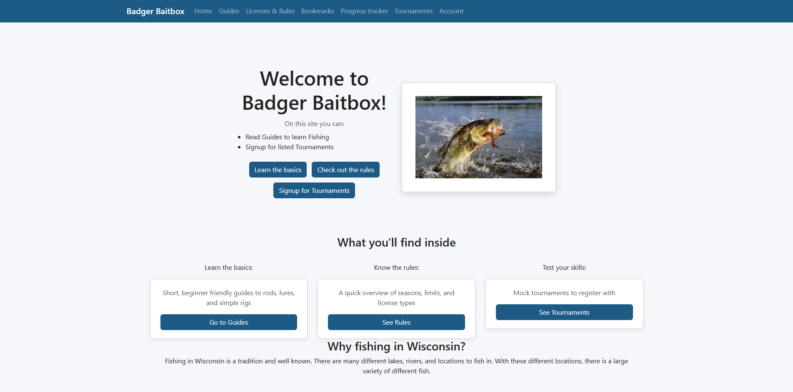
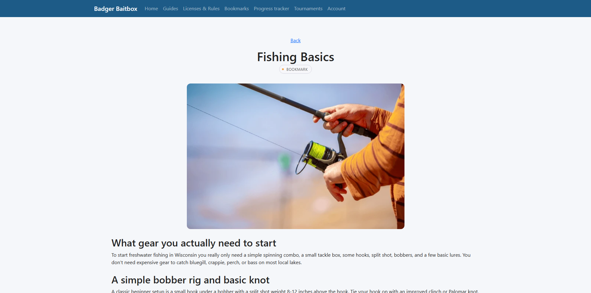
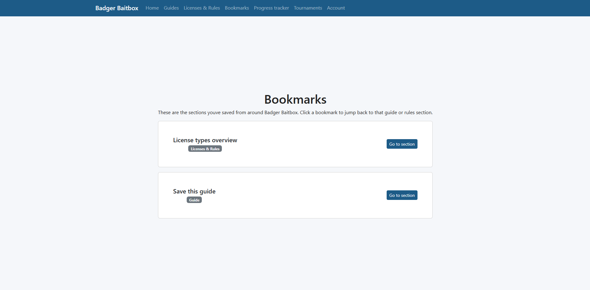
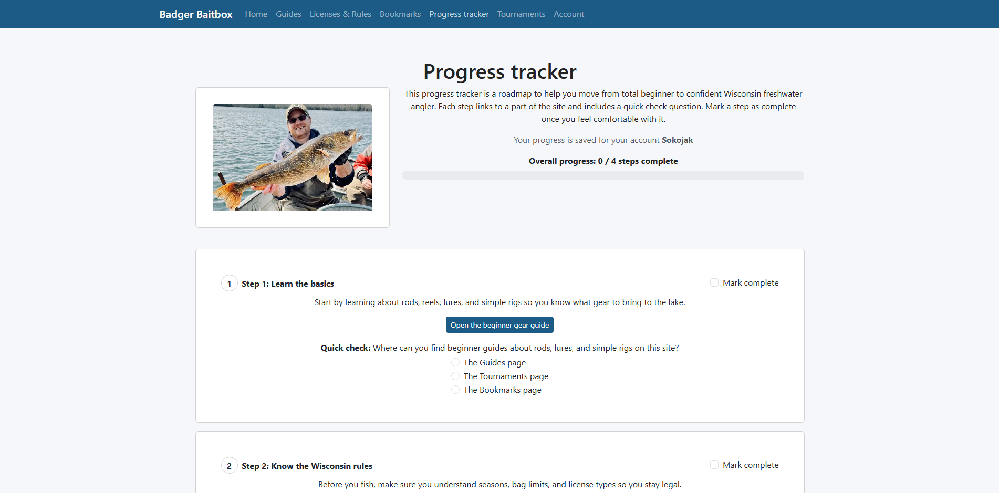
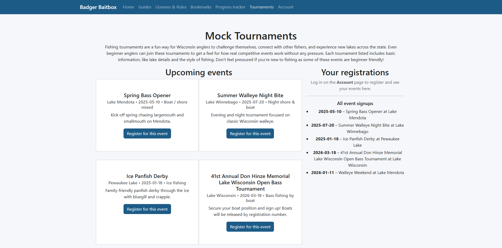

# Badger BaitBox

Originally developed as an individual project for CS 571 at the University of Wisconsin–Madison and hosted in the course GitHub organization. This repository preserves the original project history and is maintained as a portfolio copy.

Badger BaitBox is an informational web application focused on Wisconsin freshwater fishing. It is designed for beginners learning the basics of fishing, as well as anglers looking for a convenient way to review common techniques, regulations, and fishing information.

## Features

- Guides covering fishing lures, rods, and fish behavior
- Wisconsin fishing license information and fishing regulations
- User account creation and login
- Bookmarking for saving fishing guides
- Progress tracking across learning content
- Mock fishing tournament registration
- Interactive quizzes and guide navigation

## Tech Stack

- React
- JavaScript
- React Router
- React-Bootstrap
- React Context
- localStorage
- Vite

## Screenshots

### Home



### Fishing Guide



### Bookmarks



### Progress Tracker



### Tournaments



## Running Locally

1. Clone the repository.
2. Install dependencies:

   ```bash
   npm install
   ```

3. Start the development server:

   ```bash
   npm run dev
   ```

4. Open the local URL shown by Vite in your browser.
